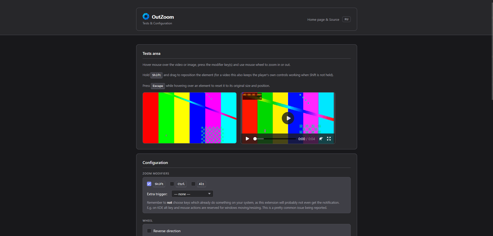
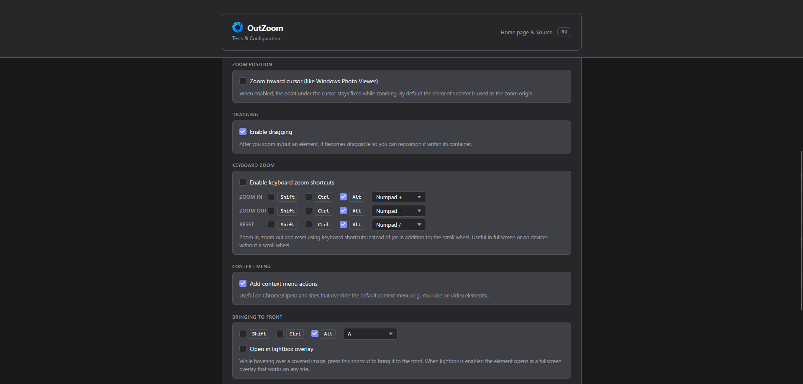
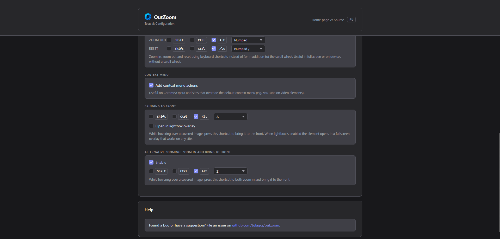

<div align="center">
<h1>OutZoom &nbsp; <a href="https://addons.mozilla.org/firefox/addon/outzoom/"></a></h1>

> Modern **Manifest V3** fork of [kpion/inzoom](https://github.com/kpion/inzoom),
> rebuilt with TypeScript and [WXT](https://wxt.dev) for current Chrome and Firefox.

Chrome: load unpacked from [Releases](../../releases)

</div>

<div align="center">

🇬🇧 [English](#english) · 🇷🇺 [Русский](#русский)

</div>

---

## English

Hover over an image or video, press <kbd>Shift</kbd> and use the mouse wheel to zoom
in and out. Once zoomed, hold <kbd>Shift</kbd> and drag to reposition the element.
Right-click for a context menu with zoom / rotate / bring-to-front / reset actions.





### Features

- Works on images, videos, SVG, canvas and CSS background images
- Drag to reposition after zooming (Shift + drag)
- Zoom toward cursor position — optional (like Windows Photo Viewer)
- **Bring to front** — lift a covered element above overlapping layers (<kbd>Alt+A</kbd> by default)
- **Lightbox mode** — open any element in a fixed fullscreen overlay, works on any site
- Rotate 90° / 180° via context menu
- Configurable zoom trigger: Shift, Ctrl, Alt, right mouse button, middle mouse button, or any key
- Keyboard zoom shortcuts (Numpad +/−) — optional, off by default
- Works inside iframes and shadow DOM
- No data collected, no external requests

### Install

| Browser | Link |
|---------|------|
| Firefox | [addons.mozilla.org/firefox/addon/outzoom](https://addons.mozilla.org/firefox/addon/outzoom/) |
| Chrome  | Download zip from [Releases](../../releases), unzip → `chrome://extensions` → Developer mode → Load unpacked |

> [!TIP]
> Firefox users can also download the `.xpi` directly from [Releases](../../releases) and install it by dragging the file into any Firefox window.

### Develop

Requires Node.js. The toolchain is [WXT](https://wxt.dev).

```bash
npm install          # also runs `wxt prepare`
npm run dev          # Chrome, with auto-reload
npm run dev:firefox  # Firefox, with auto-reload
```

### Build

```bash
npm run build            # -> .output/chrome-mv3
npm run build:firefox    # -> .output/firefox-mv3
npm run zip              # zipped artifact for the Chrome Web Store
npm run zip:firefox      # zipped artifact for AMO
```

Load unpacked from `.output/chrome-mv3` (`chrome://extensions`, Developer mode →
Load unpacked) or `.output/firefox-mv3` (`about:debugging` → This Firefox → Load
Temporary Add-on → pick `manifest.json`).

### Project layout

- `entrypoints/` — WXT entrypoints: `background.ts`, `content/`, `popup/`, `options/`
- `src/` — core: `inzoom.ts`, `config.ts`, `context-menu.ts`, `point.ts`,
  `app.ts`, `logger.ts`
- `static/` — static assets: `icon/`, plus the options-page test media
  (`test_photo.jpeg`, `sample.mp4`) and popup icons (`config.png`, `home.png`)

### License

MIT — see [LICENSE](LICENSE).

### Credits

Original extension by Konrad Papała (kpion) — [kpion/inzoom](https://github.com/kpion/inzoom).

---

## Русский

Наведите курсор на изображение или видео, зажмите <kbd>Shift</kbd> и прокрутите колесо мыши для увеличения или уменьшения. После зума удерживайте <kbd>Shift</kbd> и перетащите элемент для изменения положения. Правый клик открывает контекстное меню с действиями зума, поворота, выноса на передний план и сброса.

### Возможности

- Работает с изображениями, видео, SVG, canvas и CSS фоновыми изображениями
- Перетаскивание после зума (Shift + drag)
- Зум к курсору — опционально (как в Просмотре фотографий Windows)
- **Вынести на передний план** — поднять перекрытый элемент над другими слоями (<kbd>Alt+A</kbd> по умолчанию)
- **Режим лайтбокса** — открыть элемент в полноэкранном оверлее, работает на любом сайте
- Поворот на 90° / 180° через контекстное меню
- Настраиваемый триггер зума: Shift, Ctrl, Alt, правая кнопка мыши, средняя кнопка или любая клавиша
- Горячие клавиши для зума (Numpad +/−) — опционально, по умолчанию выключено
- Работает внутри iframe и shadow DOM
- Данные не собираются, внешних запросов нет

### Установка

| Браузер | Ссылка |
|---------|--------|
| Firefox | [addons.mozilla.org/firefox/addon/outzoom](https://addons.mozilla.org/firefox/addon/outzoom/) |
| Chrome  | Скачай zip из [Releases](../../releases), распакуй → `chrome://extensions` → Режим разработчика → Загрузить распакованное |

> [!TIP]
> Пользователи Firefox также могут скачать `.xpi` напрямую из [Releases](../../releases) и установить, просто перетащив файл в любое окно Firefox.

### Разработка

Требуется Node.js. Инструментарий — [WXT](https://wxt.dev).

```bash
npm install          # также запускает `wxt prepare`
npm run dev          # Chrome, с авто-перезагрузкой
npm run dev:firefox  # Firefox, с авто-перезагрузкой
```

### Сборка

```bash
npm run build            # -> .output/chrome-mv3
npm run build:firefox    # -> .output/firefox-mv3
npm run zip              # zip для Chrome Web Store
npm run zip:firefox      # zip для AMO
```

### Лицензия

MIT — см. [LICENSE](LICENSE).

### Благодарности

Оригинальное расширение Konrad Papała (kpion) — [kpion/inzoom](https://github.com/kpion/inzoom).
